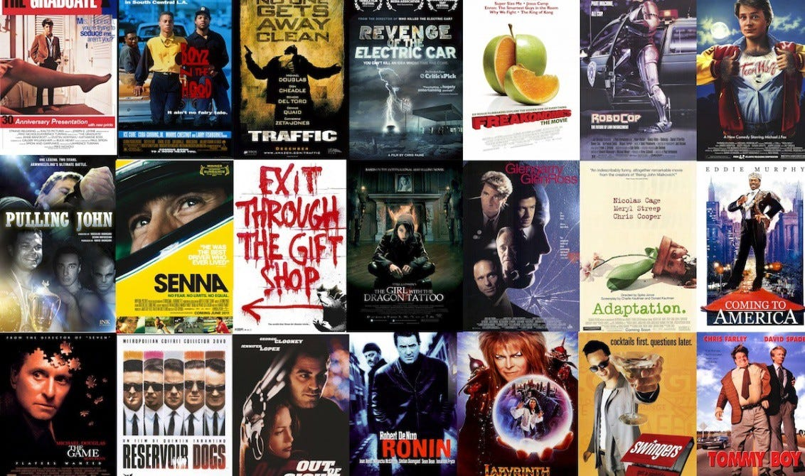

# Data Science Portfolio

## About Me

Welcome to my data science portfolio! I am a recent data science graduate with over 16 years of extensive experience in data engineering. My career has been dedicated to designing and managing data architecture, implementing ETL processes and business intelligence solutions, leading and developing backend APIs, overseeing database management, and ensuring data is clean, well-structured, and primed for analysis. With a deep proficiency in tools and technologies, I have consistently delivered scalable and robust data solutions. This strong technical background has laid a solid foundation for my transition into data science, where I now apply advanced analytical techniques to derive meaningful insights from complex datasets.

My portfolio showcases projects where I have applied advanced statistical analysis, machine learning, and deep learning techniques to solve real-world problems. From predictive modeling and time series forecasting to natural language processing and classification systems, I strive to deliver impactful solutions that drive data-driven decision-making. I thrive in collaborative environments and am dedicated to continuous learning and professional growth. My goal is to leverage my data engineering background and data science skills to contribute to innovative projects and help organizations harness the full potential of their data. I am committed to staying at the forefront of the field and continuously improving my skills.

#### Technical Skills: Python, Java, SQL and NoSQL databases, Flink, Kafka, Airflow, Hadoop, OpenSearch, Data Warehousing, Business Intelligence, AWS

## Education					       		
- M.S., Data Science | Bellevue University (_August 2024_)	 			        		
- B.E., Electronics and Communication | Anna University (_April 2007_)

## Projects

### **[Airbnb Pricing Assistant](https://github.com/kanagaraj0215/Data-Science-Projects/blob/main/supervised-machine-learning/airbnb-pricing-assistant)**
 

The Airbnb pricing assistance project, a data-driven application of machine learning in the sharing economy, leverages Linear Regression, ridge regression, and KNeighborsRegressor to predict optimal listing prices based on features such as location, property type, and amenities. By cleaning and preparing historical data from Airbnb listings, I developed and compared these models to determine the best approach for accurate price predictions. Linear regressor performed better among all these models for the given datasets. This project highlights the practical application of machine learning, offering data-driven strategies to maximize occupancy and revenue for Airbnb hosts.

### **[Creditcard Fraud Detection](https://github.com/kanagaraj0215/Data-Science-Projects/blob/main/supervised-machine-learning/creditcard-fraud-detection)**
 

The Credit Card Fraud Detection project utilizes Logistic Regression, Decision Tree Classifier, Random Forest, and XGBClassifier to identify fraudulent transactions. I developed and compared these models to achieve exceptionally high accuracy in detecting fraud. The ensemble methods, particularly Random Forest and XGBClassifier, showed superior performance in capturing complex patterns and reducing false positives. This project demonstrates the application of advanced machine learning techniques to enhance security and minimize financial losses due to fraudulent activities, providing a reassuring level of protection.

### **[Housing Price Estimator](https://github.com/kanagaraj0215/Data-Science-Projects/blob/main/supervised-machine-learning/housing-price-estimator)** 

The Housing Price Estimator project employs decision Tree algorithms to predict housing prices, exploring the model's performance with and without the chi-squared feature selection method. By preprocessing the housing dataset and incorporating significant features such as size and amenities, I developed models to estimate property values. The comparison revealed that the algorithm performed well without the dataset's chi-squared feature selection. This project underscores the value of feature selection in refining model performance for real estate price estimation.

### **[ALS Patient Clustering](https://github.com/kanagaraj0215/Data-Science-Projects/blob/main/unsupervised-learning/als-patient-clustering)**

 

The ALS Clustering project employs KMeans and Principal Component Analysis (PCA) to categorize ALS patients based on clinical features. We identified distinct patient groups with similar characteristics by reducing dimensionality with PCA and evaluating cluster quality using silhouette score. This clustering approach aids in understanding disease patterns and tailoring personalized treatment plans. The project highlights the effective use of unsupervised learning techniques to enhance medical research and patient care strategies.

### **[Digit Recognizer](https://github.com/kanagaraj0215/Data-Science-Projects/blob/main/deep-learning/digit-recognizer)**

 

The Digit Recognizer project employs Convolutional Neural Networks (CNN) to classify handwritten digits accurately using the MNIST dataset. By training the CNN on this extensive collection of labeled digit images, the model achieved high accuracy in recognizing and categorizing each digit from 0 to 9. This project not only demonstrates the effectiveness of deep learning in image recognition tasks but also serves as a foundation for more complex applications, showcasing the practical implementation and potential of CNNs in the field of computer vision, thereby inspiring innovation in the audience.

### **[Bank Customer Complaint Classifier](https://github.com/kanagaraj0215/Data-Science-Projects/blob/main/natural-language-processing/bank-customer-complaint-classifier)** 

The Bank Customer Complaint Classification project utilizes Natural Language Processing (NLP) techniques to categorize customer complaints using Random Forest and Multinomial Naive Bayes classifiers. By experimenting with feature extraction techniques, including Bag of Words and TD-IDF, I developed models that effectively identify various complaint types. This project showcases the application of NLP and machine learning to enhance customer service by efficiently classifying and addressing customer issues. It not only improves overall satisfaction and operational efficiency but also demonstrates the practical implications of machine learning in real-world scenarios, inspiring innovation in the audience.

### **[Movie Recommender System](https://github.com/kanagaraj0215/Data-Science-Projects/blob/main/natural-language-processing/movie-recommender-system)**

 

The Movie Recommender System project utilizes a content-based filtering approach, leveraging the TF-IDF Vectorizer to recommend movies. By analyzing movie descriptions and transforming them into numerical vectors, the model identifies and suggests films similar to those users have liked. This project not only highlights the application of Natural Language Processing (NLP) techniques but also emphasizes the potential of machine learning to enhance user experience by providing personalized movie recommendations based on content similarity.

### **[Movie Review Sentiment Analysis](https://github.com/kanagaraj0215/Data-Science-Projects/blob/main/natural-language-processing/movie-review-sentiment-analysis)**

The Movie Review Sentiment Analysis project employs TextBlob and VADER for initial sentiment analysis, providing quick and straightforward polarity assessments of reviews. Further, by applying NLP techniques such as tokenization and vectorization, I developed logistic regression and KNeighbors Classifier models to enhance sentiment classification accuracy. This project demonstrates the integration of basic and advanced methods to improve sentiment analysis, offering valuable insights into audience options and enhancing recommendation systems.

### **[Retail Forecast](https://github.com/kanagaraj0215/Data-Science-Projects/blob/main/deep-learning/retail-forecast)**

The Retail Forecast project uses ARIMA and LSTM models to predict future sales trends. ARIMA, a statistical method, captures linear patterns in sales data, while LSTM, a deep learning model, excels at recognizing complex temporal dependencies. By combining these approaches, I achieved a more accurate and robust forecast, providing valuable insights for inventory management and strategic planning. This project demonstrates the effectiveness of integrating traditional and advanced techniques to enhance predictive accuracy in retail analytics.

### **[Email Defender](https://github.com/kanagaraj0215/Data-Science-Projects/blob/main/deep-learning/email-defender)**

This project focuses on enhancing email spam detection by evaluating the performance of two different models: a Random Forest classifier with TF-IDF feature extraction and a fine-tuned BERT model. By comparing these approaches, the project aims to determine which model delivers superior accuracy, precision, recall, and F1-score in identifying spam emails. The insights gained from this comparison can help companies enhance their email security, reduce the risk of phishing attacks, and boost employee productivity by minimizing the intrusion of spam into their inboxes.

 

## Contact Information
- **Email**: [kanagaraj0215@gmail.com](kanagaraj0215@gmail.com)
- **LinkedIn**: [kanagaraj-ramasamy](https://www.linkedin.com/in/kanagaraj-ramasamy-75468b77)

